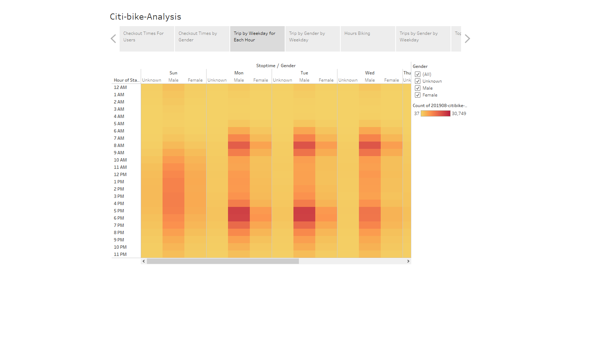

#Bikesharing

## Overview of the analysis: 

Welcome to our Analysis of Citibike's consumer use and effectiveness within NewYork area. We are taking a look at how long bikes are checked out for all riders and genders.
How many trips are taken by the hour for each day of the week, for all riders and genders. A breakdown of what days of the week a user might be more likely to check out a bike, by type of user and gender. Our Goal is to look at strenghs weaknesses and potentials to bring together a Biking sharing service in our home city.

Lets take a look first at the checkout times for users. You will notice that the average time users keep the bikes out is about 1 hour with the peak at 20 minutes. That says alot and raises several questions like, Why only 1 hour max ? Is it because many use the service to get away from the city traffic ? Let's look at our data below about who rides the most.

It is said "Pictures say A thousand words": Our graph tells us that the male populaiton generally uses the service more. With this data we can perhaps attribute this usage to college students who would use the services to get to class or do an early routine. We can also understand our first graph a bit better about checkout times by looking at our gender usage. 
As we look deeper into our usage by times and Gender, Let us breakdown the usage by times in the day.

Notice that most of the rides are used mainly between and Saturday. Sunday is not used as much. We can also see that the rides are mainly used between 7am and 7pm with the 
highest usage at 7-9am then 5-7pm. With that data we can come to a conclusion that our bikes usage is based on certain life activities that makes using our service an easier task.

As we mentioned before, We have noticed that the males usage dominiates our bike sharing service. Take a look at how it differs between customers and Subscribers. 

## Results:
With each graph our data shows the usage of our bikes services has been dominated by the male gender. We also see that the times of our usage is heavily weighted around times of the day that personal activites seem to dominant. Wether usage is used to get to work, classes or as a work out system activites in the morning and evening has stood out in our data analysis. By taking a look at our graph below we are able to see a clearer time stamp of usage.

## Summary: 
We were able to Identify the times Citibike services are being used the most. We also saw which Genders used the service mainly and whether they were just random users or subscribers. One of Citibike strengh's is to provide a viable service to users in making the service available at safer transit times. It is much safer to travel on the roads ealier in the day or later after the rush hours died down. But, with the data we have, we believe there is room for some improvement in total usage. For example, How can CitiBikes get the female gender more intouch with this service? Our Data shows a significant opportunity to bring in more subscribers. As we look at bringing this model to our much smaller city, we can take away the strenghs and capitalize on the building oportunities to create an effective bike sharing service. 

See the top ending location for usage with Citibike. This helps us understand usage much better. 

## Summary: 
We were able to Identify the times Citibike services are being used the most. We also saw which Genders used the service mainly and whether they were just random users or subscribers. One of Citibike strengh's is to provide a viable service to users in making the service available at safer transit times. It is much safer to travel on the roads ealier in the day or later after the rush hours died down. But, with the data we have, we believe there is room for some improvement in total usage. For example, How can CitiBikes get the female gender more intouch with this service? Our Data shows a significant opportunity to bring in more subscribers. As we look at bringing this model to our much smaller city, we can take away the strenghs and capitalize on the building oportunities to create an effective bike sharing service. 

See our Interactive data !
https://public.tableau.com/profile/timerson.challenger#!/vizhome/NYC-Citibike-Challenge/Citi-bike-Analysis

